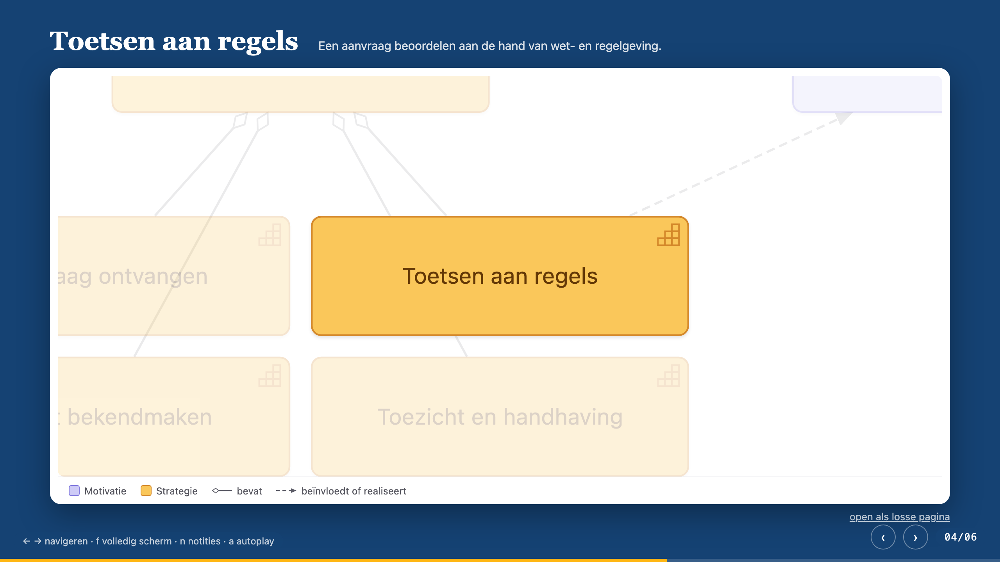
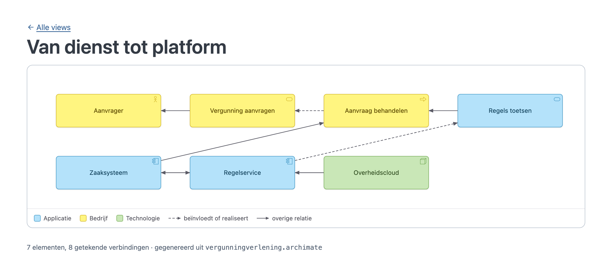
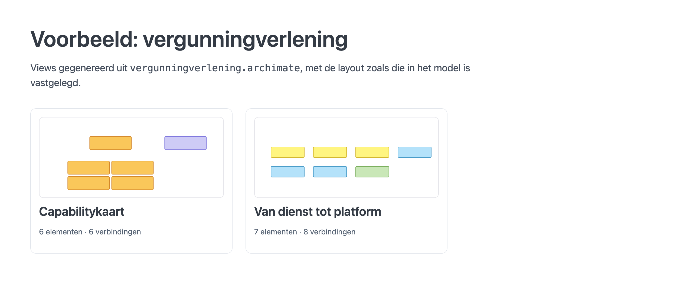

# AI-assisted architecting

[](https://github.com/NederlandseDigitaleDienst/ai-assisted-architecting/actions/workflows/ci.yml)
[](https://pypi.org/project/archi-cli/)
[](https://pypi.org/project/archi-cli/)
[](LICENSE)

Houd je ArchiMate-model bij zoals code, zelf of samen met een AI-assistent.
Deze repository levert daarvoor twee dingen die op elkaar aansluiten:

- **`archi-cli`**, een command line tool voor native
  [Archi](https://www.archimatetool.com/)-modellen. Je bekijkt, wijzigt en
  controleert een `.archimate`-bestand vanuit de terminal en genereert er views,
  webpagina's en presentaties uit. Elke wijziging wordt gevalideerd voordat hij
  wordt opgeslagen, zodat het model nooit kapot raakt.
- **Skills voor AI-assistenten**, als plugin voor
  [Claude Code](https://claude.com/claude-code). Ze leren een assistent hoe hij
  met `archi-cli` aan je model werkt: wijzigen, views maken en presentaties
  bouwen, met validatie en normalisatie op de juiste momenten.

De tool werkt prima zonder de skills. De skills hebben de tool nodig, want een
assistent wijzigt het model uitsluitend via `archi`, nooit door zelf in de XML
te schrijven.



*Een slide uit het meegeleverde voorbeeld: de camera zoomt in op één
element en dimt de rest. Gegenereerd uit het model, zonder handwerk.*

## Wat zit erin

| Onderdeel | Wat het doet | Installeren |
| --- | --- | --- |
| `archi-cli` | Inspecteren, wijzigen, valideren, normaliseren en publiceren van `.archimate`-modellen | `uv tool install archi-cli` ([PyPI](https://pypi.org/project/archi-cli/)) |
| Skill `nldd-archi-model` | Het model wijzigen: elementen, relaties, properties en documentatie | Plugin `nldd-archi` |
| Skill `nldd-archi-view` | Views genereren en opruimen, met een automatische layout | Plugin `nldd-archi` |
| Skill `nldd-archi-slides` | Presentaties samenstellen uit views en tekst | Plugin `nldd-archi` |

## Wat het is, en wat niet

**Wel:**

- Een **command line tool** die het native Archi-formaat leest en schrijft. Het
  bestand blijft gewoon te openen en te bewerken in Archi.
- Een **vangnet**. Elke mutatie wordt eerst in het geheugen gevalideerd; bij een
  fout weigert de tool op te slaan. Ids blijven onveranderd.
- **Deterministisch.** Dezelfde invoer geeft dezelfde uitvoer, zodat diffs klein
  blijven en je de uitvoer in CI kunt controleren.
- **Skills** die een AI-assistent dezelfde werkwijze laten volgen als een
  zorgvuldige architect: eerst kijken, dan via de CLI wijzigen, valideren,
  normaliseren en de views bijwerken.

**Niet:**

- **Geen vervanging van Archi.** Vrij modelleren op het canvas en de layout van
  een view fijnslijpen doe je in Archi. De tool en Archi werken op hetzelfde
  bestand en vullen elkaar aan.
- **Geen ArchiMate-validator.** `archi validate` controleert de integriteit van
  het bestand en je eigen conventies, niet of een relatie volgens de
  ArchiMate-specificatie is toegestaan.
- **Geen AI in de tool.** `archi-cli` bevat geen AI en stuurt je model nergens
  heen; alleen het eenmalig ophalen van de Archi-engine gebruikt het netwerk.
  Gebruik je de skills, dan leest je AI-assistent het model. Waar die zijn
  gegevens verwerkt, bepaal je met de keuze van je assistent, niet met deze
  repository.
- **Geen officieel product of standaard.** Het is open source software in de
  bètafase, zonder garanties of ondersteuningsafspraken.

## Snel aan de slag

### Met de command line tool

Je hebt [uv](https://docs.astral.sh/uv/) nodig; uv regelt zelf een passende
Python (3.12 of nieuwer).

```bash
uv tool install archi-cli
archi --version
```

Probeer het op het meegeleverde voorbeeld, een fictief model van een gemeente
die vergunningen verleent:

```bash
git clone https://github.com/NederlandseDigitaleDienst/ai-assisted-architecting.git
cd ai-assisted-architecting/examples/vergunningverlening
archi stats                          # wat zit er in het model
archi show "Toetsen aan regels"      # één element met zijn relaties
archi render                         # views en slides naar views/
```

Open daarna `views/html/index.html` in je browser. De Mermaid-versies van de
views staan [hier op GitHub](examples/vergunningverlening/views/README.md) al
gerenderd.

Voor je eigen model: draai `archi` in de map met je `.archimate`-bestand, of
leg het vast in een `archi.toml` (zie [Configuratie](#configuratie)).

### Met een AI-assistent

Installeer eerst `archi-cli` zoals hierboven, en daarna de plugin `nldd-archi`
uit de [marketplace van de NLDD](https://github.com/NederlandseDigitaleDienst/ai-plugins).
In Claude Code:

```
/plugin marketplace add NederlandseDigitaleDienst/ai-plugins
/plugin install nldd-archi@nldd
```

In Cursor importeer je de marketplace via **Dashboard → Settings → Plugins →
Import** met de repository `NederlandseDigitaleDienst/ai-plugins`.

Open Claude Code in de map van je model (of in
`examples/vergunningverlening/`) en vraag in gewone taal wat je wilt:

> Voeg een capability "Toezicht" toe onder Vergunningverlening, met een korte
> omschrijving.

> Maak een view van Vergunningverlening met alles wat eraan gekoppeld is.

> Maak een presentatie die begint bij de capabilitykaart en inzoomt op
> "Toetsen aan regels".

Wil je dat iedereen die aan een project werkt de plugin krijgt, zet hem dan in
`.claude/settings.json` van dat project. Claude Code vraagt dan bij het openen
of de plugin geïnstalleerd mag worden:

```json
{
  "extraKnownMarketplaces": {
    "nldd": {
      "source": { "source": "github", "repo": "NederlandseDigitaleDienst/ai-plugins" }
    }
  },
  "enabledPlugins": {
    "nldd-archi@nldd": true
  }
}
```

De assistent kiest zelf de passende skill. Zie [De skills](#de-skills) voor wat
elke skill doet.

## Wat `archi-cli` kan

| Taak | Commando's |
| --- | --- |
| Inspecteren | `stats`, `list`, `show`, `tree` |
| Wijzigen | `add-element`, `add-relation`, `set-property`, `remove-property`, `set-documentation`, `rename`, `move`, `remove`, `set-model-name` |
| Views genereren | `add-view` met grid- of clusterlayout, geselecteerd op type, property, relatie of vanuit één element |
| Controleren | `validate` |
| Normaliseren | `normalize` |
| Publiceren | `render` (views) en `slides` (presentaties) |

`archi <commando> --help` toont alle opties. Een paar voorbeelden:

```bash
archi add-element --type Capability --name "Toezicht" --documentation "Naleving controleren."
archi add-relation --type Aggregation --source "Vergunningverlening" --target "Toezicht"
archi move "Toezicht" --subfolder "Gebied handhaving" --create-subfolder
archi add-view --name "Capabilities" --layout cluster --type Capability
archi remove "Toezicht" --cascade      # ook relaties en view-objecten
```

**Controleren.** `archi validate` vindt onder meer dubbele ids, relaties naar
elementen die niet bestaan, elementen in de verkeerde laagmap, kapotte views en
property-keys die niet in je conventielijst staan. Mutaties draaien dezelfde
controles automatisch.

**Normaliseren.** `archi normalize` laat Archi zelf het bestand opnieuw wegschrijven,
in zijn eigen canonieke vorm. Zo blijven git-diffs klein, of een wijziging nu
uit de tool of uit Archi komt. De Archi-engine haalt de tool bij het eerste
gebruik zelf op en controleert de download.

**Publiceren.** `archi render` zet elke view om naar Mermaid (dat GitHub direct
toont) en naar een webpagina met de layout en de ArchiMate-notatie uit het
model, gestileerd met het [NLDD Design System](https://github.com/NederlandseDigitaleDienst/design-system).
Een indexpagina toont alle views met een miniatuur.



**Presenteren.** Een deck in `decks/*.toml` beschrijft een lineair verhaal met
views uit het model, afgewisseld met tekst. `archi slides` maakt er een
zelfstandige HTML-presentatie van, met zoom-op-een-element, sprekersnotities en
volledig scherm. Zie [het voorbeelddeck](examples/vergunningverlening/decks/rondleiding.toml).

**Doorklikken.** Met een links-bestand worden elementen in de webpagina's
klikbaar naar een andere view of een ander bestand, bijvoorbeeld een diagram
dat je met eigen scripts maakt. Zie [ADR 0010](adr/0010-doorklikken-via-links-bestand.md).



## Configuratie

De tool zoekt het model in deze volgorde: de optie `--model <pad>` (vóór het
subcommando), de sleutel `model` in een `archi.toml` (in de werkmap of een map
erboven), of het enige `.archimate`-bestand in de werkmap.

```toml
# archi.toml
[tool.archi]
model = "model/architectuur.archimate"
conventions = "docs/conventies.md"   # toegestane property-keys
links = "links.toml"                 # doorkliks in de webpagina's
fonts = "system"                     # of "rijkssans", zie hieronder
```

Alle sleutels zijn optioneel. Dezelfde tabel mag ook in een `pyproject.toml`.

**Lettertype.** De webpagina's gebruiken standaard het systeemlettertype.
RijksSans is uitsluitend bedoeld voor publicaties van de Rijksoverheid en
partijen die in haar opdracht werken; valt jouw publicatie daaronder, zet dan
`fonts = "rijkssans"`.

## De skills

Een skill is een korte handleiding in tekst (`SKILL.md`) die een AI-assistent
laadt wanneer je vraag erbij past. De skills bevatten geen code: ze vertellen
de assistent welke `archi`-commando's hij gebruikt, in welke volgorde, en waar
hij op moet letten. Ze staan in [`skills/`](skills/).

- **[`nldd-archi-model`](skills/nldd-archi-model/SKILL.md)** wijzigt het model.
  De assistent kijkt eerst wat er staat (`archi show`, `archi list`), wijzigt
  via de CLI, zet omschrijvingen in het documentatieveld van Archi, valideert,
  normaliseert en werkt de views bij. Verwijderen met `--cascade` gebeurt alleen
  bewust.
- **[`nldd-archi-view`](skills/nldd-archi-view/SKILL.md)** maakt views: een
  selectie op type, property of relatie, of een detailview van één element met
  alles eromheen, in een raster- of clusterlayout.
- **[`nldd-archi-slides`](skills/nldd-archi-slides/SKILL.md)** schrijft decks in
  `decks/*.toml`: een lineair verhaal met views uit het model, zoomslides op één
  element en tekst daartussen, en rendert ze naar HTML.

De plugin brengt alleen de skills mee; het commando `archi` installeer je los
met uv. De tool garandeert dat het model technisch klopt, niet dat de
architectuur klopt. Lees wijzigingen van een assistent na zoals je een pull
request van een collega naleest.

## Grenzen en bekende beperkingen

- **Alleen het native Archi-formaat** (`.archimate`). Het Open Group
  Exchange-formaat wordt niet gelezen of geschreven.
- **`normalize` heeft de Archi-engine nodig** (ongeveer 165 MB, eenmalig).
  Archi levert die voor macOS (Intel en Apple Silicon) en voor 64-bit x86 op
  Linux en Windows. Op andere platforms installeer je Archi zelf en wijs je hem
  aan met de omgevingsvariabele `ARCHI_APP`. Alle andere commando's werken
  zonder Archi.
- **Automatische layout is een startpunt.** `add-view` plaatst elementen in een
  raster of in clusters; bij grotere views schuif je in Archi nog wat bij.
- **Niet alles wordt gerenderd.** Sketch- en canvasviews, afbeeldingen en eigen
  kleuren en lettertypes uit Archi komen niet in de webpagina's.
- **De webpagina's laden het design system van een CDN** en hebben dus internet
  nodig om goed te tonen.
- **De skills zijn geschreven en getest voor Claude Code.** De plugin heeft ook
  een manifest voor Cursor, maar in Cursor is hij nog niet geprobeerd.
- **Uitvoer en meldingen zijn Nederlandstalig.**

## Disclaimer

Deze software wordt geleverd zoals hij is, zonder enige garantie; zie de
artikelen 7 en 8 van de [EUPL-1.2](LICENSE). De tool is in bètafase: tot versie
1.0 kunnen commando's en uitvoer nog veranderen. Elke wijziging die je moet
weten staat in de [changelog](CHANGELOG.md).

ArchiMate is een geregistreerd handelsmerk van The Open Group. Dit project is
onafhankelijk en niet verbonden aan The Open Group of het Archi-project.

## Meedoen

Bijdragen zijn welkom: lees [CONTRIBUTING.md](CONTRIBUTING.md) voor de
werkwijze en de [gedragscode](CODE_OF_CONDUCT.md). Een beveiligingsprobleem meld
je volgens [SECURITY.md](SECURITY.md), niet in een openbaar issue.
Beslissingen over de opzet van de tool staan als ADR's in [`adr/`](adr/).

## Licentie

[EUPL-1.2](LICENSE), voor zowel de tool als de skills. Ontwikkeld door de
Nederlandse Digitale Dienst. Archi
zelf valt onder de MIT-licentie; zie [NOTICE](NOTICE).
