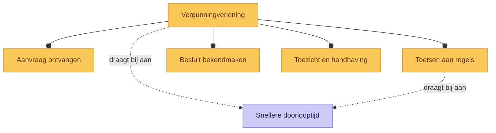

<!-- Gegenereerd door `archi render` — niet handmatig bewerken -->

# Capabilitykaart

*Gegenereerd uit `vergunningverlening.archimate` — pijlstijlen: `--o` bevat (aggregatie/compositie), `-.->` gestippeld (beïnvloedt/realiseert), `-->` overig.*
